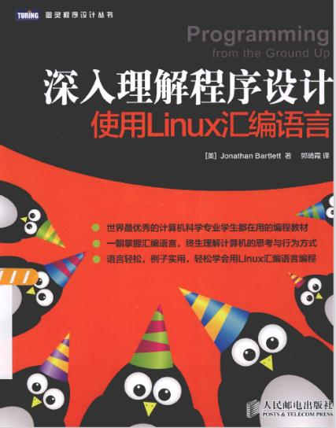

# 深入理解程序设计 使用Linux汇编语言 示例代码

#### 参考项目链接: 

- <https://github.com/swseverance/programming-from-the-ground-up>
- <https://github.com/andrewclarkii/Programming-from-ground-up>
- <https://github.com/VasilyFomin/programming_from_ground_up/blob/master/Makefile>

